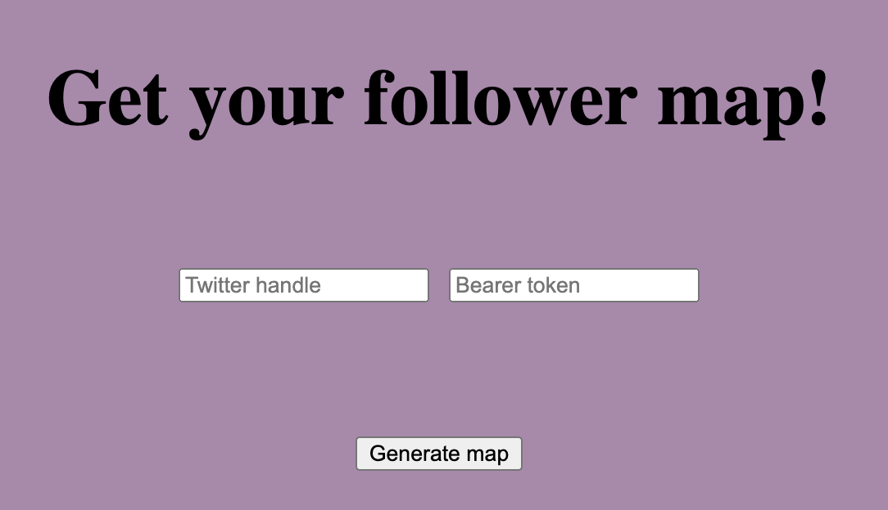

# Lab tasks 2 & 3

## Task 2
The *json_navigation.py* module enables the user to navigate a *.json* file. 
When the user runs the *data_navigation* function, they are prompted to choose 
one of the available keys or list indices and they can go deeper into 
the file until they reach a file type? that is neither a list nor a dictionary.

Here's an example of how it works:

## Task 3
The *twit.py, location.py, flask_info.py* modules create a map 
with markers, which represent the locations of a Twitter user. The web app requires the user to 
enter a Twitter handle and their bearer token and generates a map. If there is something wrong with the 
information or the user does not exist the web app returns an error screen

